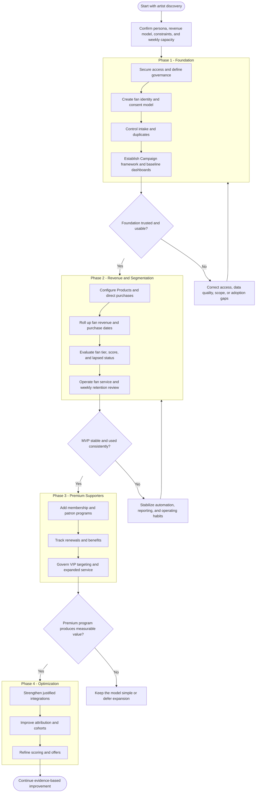

# Four-Phase Roadmap

```mermaid
flowchart TD
    A([Start with artist discovery]) --> B[Confirm persona, revenue model, constraints, and weekly capacity]
    B --> P1

    subgraph P1[Phase 1 - Foundation]
        C[Secure access and define governance] --> D[Create fan identity and consent model]
        D --> E[Control intake and duplicates]
        E --> F[Establish Campaign framework and baseline dashboards]
    end

    F --> G1{Foundation trusted and usable?}
    G1 -- No --> R1[Correct access, data quality, scope, or adoption gaps]
    R1 --> P1
    G1 -- Yes --> P2

    subgraph P2[Phase 2 - Revenue and Segmentation]
        G[Configure Products and direct purchases] --> H[Roll up fan revenue and purchase dates]
        H --> I[Evaluate fan tier, score, and lapsed status]
        I --> J[Operate fan service and weekly retention review]
    end

    J --> G2{MVP stable and used consistently?}
    G2 -- No --> R2[Stabilize automation, reporting, and operating habits]
    R2 --> P2
    G2 -- Yes --> P3

    subgraph P3[Phase 3 - Premium Supporters]
        K[Add membership and patron programs] --> L[Track renewals and benefits]
        L --> M[Govern VIP targeting and expanded service]
    end

    M --> G3{Premium program produces measurable value?}
    G3 -- No --> R3[Keep the model simple or defer expansion]
    G3 -- Yes --> P4

    subgraph P4[Phase 4 - Optimization]
        N[Strengthen justified integrations] --> O[Improve attribution and cohorts]
        O --> P[Refine scoring and offers]
    end

    P --> Q([Continue evidence-based improvement])
```

