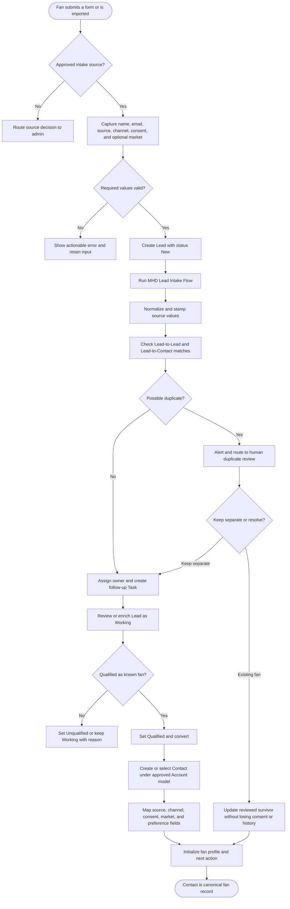

# Fan Intake and Lead Management

```mermaid
flowchart TD
    A([Fan submits a form or is imported]) --> B{Approved intake source?}
    B -- No --> C[Route source decision to admin]
    B -- Yes --> D[Capture name, email, source, channel, consent, and optional market]
    D --> E{Required values valid?}
    E -- No --> F[Show actionable error and retain input]
    E -- Yes --> G[Create Lead with status New]
    G --> H[Run MHD Lead Intake Flow]
    H --> I[Normalize and stamp source values]
    I --> J[Check Lead-to-Lead and Lead-to-Contact matches]
    J --> K{Possible duplicate?}
    K -- Yes --> L[Alert and route to human duplicate review]
    K -- No --> M[Assign owner and create follow-up Task]
    L --> N{Keep separate or resolve?}
    N -- Keep separate --> M
    N -- Existing fan --> O[Update reviewed survivor without losing consent or history]
    M --> P[Review or enrich Lead as Working]
    P --> Q{Qualified as known fan?}
    Q -- No --> R[Set Unqualified or keep Working with reason]
    Q -- Yes --> S[Set Qualified and convert]
    S --> T[Create or select Contact under approved Account model]
    T --> U[Map source, channel, consent, market, and preference fields]
    U --> V[Initialize fan profile and next action]
    O --> V
    V --> W([Contact is canonical fan record])
```

