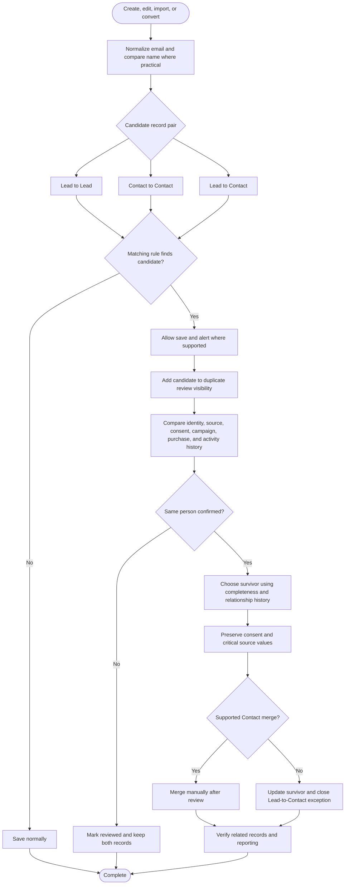

# Duplicate Review and Merge

```mermaid
flowchart TD
    A([Create, edit, import, or convert]) --> B[Normalize email and compare name where practical]
    B --> C{Candidate record pair}
    C --> D[Lead to Lead]
    C --> E[Contact to Contact]
    C --> F[Lead to Contact]
    D --> G{Matching rule finds candidate?}
    E --> G
    F --> G
    G -- No --> H[Save normally]
    G -- Yes --> I[Allow save and alert where supported]
    I --> J[Add candidate to duplicate review visibility]
    J --> K[Compare identity, source, consent, campaign, purchase, and activity history]
    K --> L{Same person confirmed?}
    L -- No --> M[Mark reviewed and keep both records]
    L -- Yes --> N[Choose survivor using completeness and relationship history]
    N --> O[Preserve consent and critical source values]
    O --> P{Supported Contact merge?}
    P -- Yes --> Q[Merge manually after review]
    P -- No --> R[Update survivor and close Lead-to-Contact exception]
    Q --> S[Verify related records and reporting]
    R --> S
    H --> T([Complete])
    M --> T
    S --> T
```

