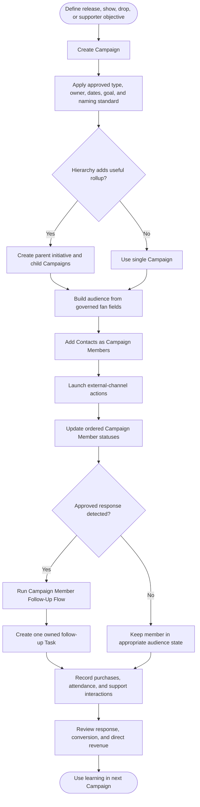

# Campaign Audience and Follow-Up

```mermaid
flowchart TD
    A([Define release, show, drop, or supporter objective]) --> B[Create Campaign]
    B --> C[Apply approved type, owner, dates, goal, and naming standard]
    C --> D{Hierarchy adds useful rollup?}
    D -- Yes --> E[Create parent initiative and child Campaigns]
    D -- No --> F[Use single Campaign]
    E --> G[Build audience from governed fan fields]
    F --> G
    G --> H[Add Contacts as Campaign Members]
    H --> I[Launch external-channel actions]
    I --> J[Update ordered Campaign Member statuses]
    J --> K{Approved response detected?}
    K -- Yes --> L[Run Campaign Member Follow-Up Flow]
    L --> M[Create one owned follow-up Task]
    K -- No --> N[Keep member in appropriate audience state]
    M --> O[Record purchases, attendance, and support interactions]
    N --> O
    O --> P[Review response, conversion, and direct revenue]
    P --> Q([Use learning in next Campaign])
```

