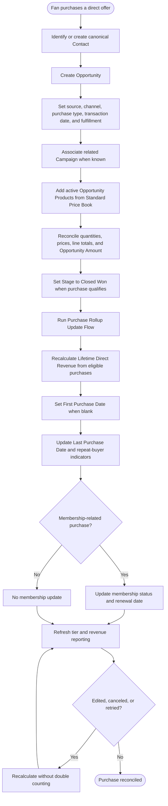

# Direct Offer Purchase

```mermaid
flowchart TD
    A([Fan purchases a direct offer]) --> B[Identify or create canonical Contact]
    B --> C[Create Opportunity]
    C --> D[Set source, channel, purchase type, transaction date, and fulfillment]
    D --> E[Associate related Campaign when known]
    E --> F[Add active Opportunity Products from Standard Price Book]
    F --> G[Reconcile quantities, prices, line totals, and Opportunity Amount]
    G --> H[Set Stage to Closed Won when purchase qualifies]
    H --> I[Run Purchase Rollup Update Flow]
    I --> J[Recalculate Lifetime Direct Revenue from eligible purchases]
    J --> K[Set First Purchase Date when blank]
    K --> L[Update Last Purchase Date and repeat-buyer indicators]
    L --> M{Membership-related purchase?}
    M -- Yes --> N[Update membership status and renewal date]
    M -- No --> O[No membership update]
    N --> P[Refresh tier and revenue reporting]
    O --> P
    P --> Q{Edited, canceled, or retried?}
    Q -- Yes --> R[Recalculate without double counting]
    R --> P
    Q -- No --> S([Purchase reconciled])
```

