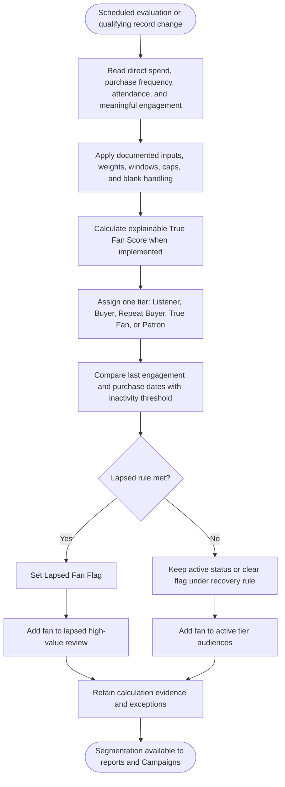

# Fan Tier and Lapsed Evaluation

```mermaid
flowchart TD
    A([Scheduled evaluation or qualifying record change]) --> B[Read direct spend, purchase frequency, attendance, and meaningful engagement]
    B --> C[Apply documented inputs, weights, windows, caps, and blank handling]
    C --> D[Calculate explainable True Fan Score when implemented]
    D --> E[Assign one tier: Listener, Buyer, Repeat Buyer, True Fan, or Patron]
    E --> F[Compare last engagement and purchase dates with inactivity threshold]
    F --> G{Lapsed rule met?}
    G -- Yes --> H[Set Lapsed Fan Flag]
    H --> I[Add fan to lapsed high-value review]
    G -- No --> J[Keep active status or clear flag under recovery rule]
    J --> K[Add fan to active tier audiences]
    I --> L[Retain calculation evidence and exceptions]
    K --> L
    L --> M([Segmentation available to reports and Campaigns])
```

