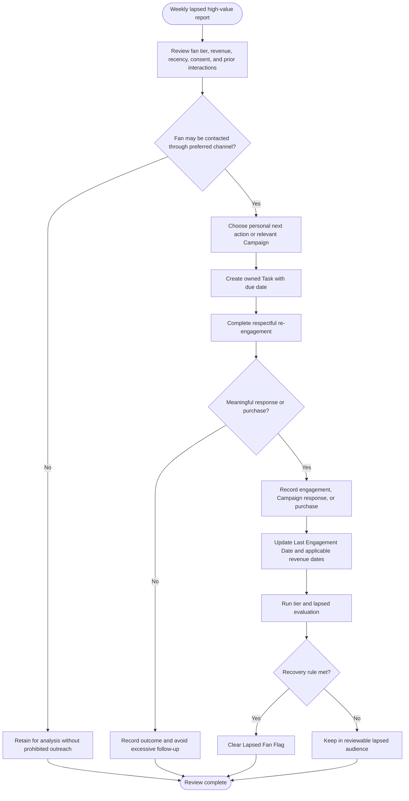

# Lapsed Fan Re-Engagement

```mermaid
flowchart TD
    A([Weekly lapsed high-value report]) --> B[Review fan tier, revenue, recency, consent, and prior interactions]
    B --> C{Fan may be contacted through preferred channel?}
    C -- No --> D[Retain for analysis without prohibited outreach]
    C -- Yes --> E[Choose personal next action or relevant Campaign]
    E --> F[Create owned Task with due date]
    F --> G[Complete respectful re-engagement]
    G --> H{Meaningful response or purchase?}
    H -- No --> I[Record outcome and avoid excessive follow-up]
    H -- Yes --> J[Record engagement, Campaign response, or purchase]
    J --> K[Update Last Engagement Date and applicable revenue dates]
    K --> L[Run tier and lapsed evaluation]
    L --> M{Recovery rule met?}
    M -- Yes --> N[Clear Lapsed Fan Flag]
    M -- No --> O[Keep in reviewable lapsed audience]
    D --> P([Review complete])
    I --> P
    N --> P
    O --> P
```

