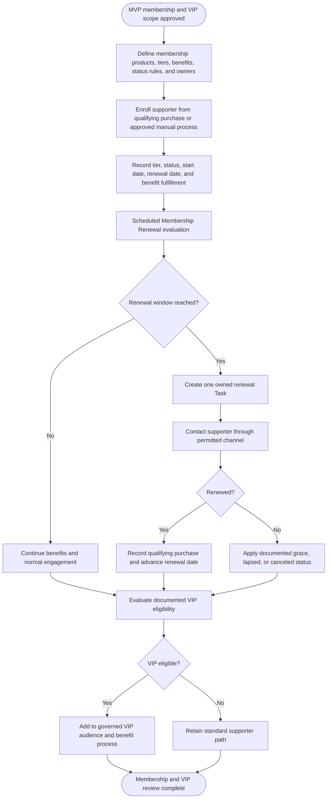

# Membership Renewal and VIP

```mermaid
flowchart TD
    A([MVP membership and VIP scope approved]) --> B[Define membership products, tiers, benefits, status rules, and owners]
    B --> C[Enroll supporter from qualifying purchase or approved manual process]
    C --> D[Record tier, status, start date, renewal date, and benefit fulfillment]
    D --> E[Scheduled Membership Renewal evaluation]
    E --> F{Renewal window reached?}
    F -- No --> G[Continue benefits and normal engagement]
    F -- Yes --> H[Create one owned renewal Task]
    H --> I[Contact supporter through permitted channel]
    I --> J{Renewed?}
    J -- Yes --> K[Record qualifying purchase and advance renewal date]
    J -- No --> L[Apply documented grace, lapsed, or canceled status]
    G --> M[Evaluate documented VIP eligibility]
    K --> M
    L --> M
    M --> N{VIP eligible?}
    N -- Yes --> O[Add to governed VIP audience and benefit process]
    N -- No --> P[Retain standard supporter path]
    O --> Q([Membership and VIP review complete])
    P --> Q
```
