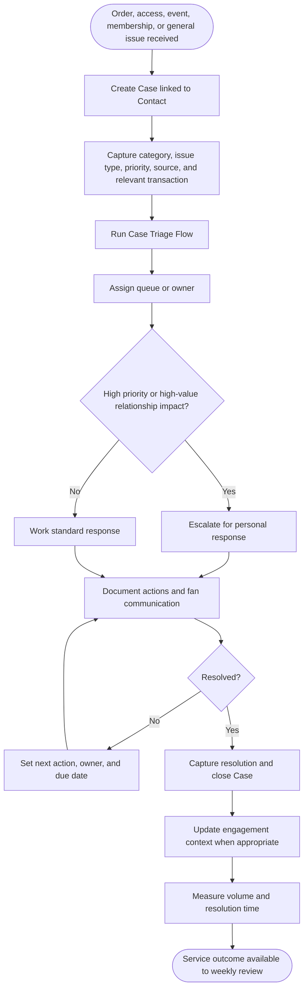

# Case Triage and Fan Service

```mermaid
flowchart TD
    A([Order, access, event, membership, or general issue received]) --> B[Create Case linked to Contact]
    B --> C[Capture category, issue type, priority, source, and relevant transaction]
    C --> D[Run Case Triage Flow]
    D --> E[Assign queue or owner]
    E --> F{High priority or high-value relationship impact?}
    F -- Yes --> G[Escalate for personal response]
    F -- No --> H[Work standard response]
    G --> I[Document actions and fan communication]
    H --> I
    I --> J{Resolved?}
    J -- No --> K[Set next action, owner, and due date]
    K --> I
    J -- Yes --> L[Capture resolution and close Case]
    L --> M[Update engagement context when appropriate]
    M --> N[Measure volume and resolution time]
    N --> O([Service outcome available to weekly review])
```

