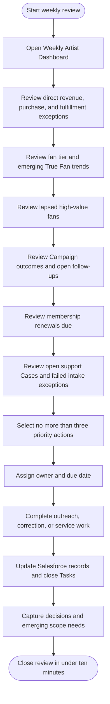

# Weekly Artist Review

```mermaid
flowchart TD
    A([Start weekly review]) --> B[Open Weekly Artist Dashboard]
    B --> C[Review direct revenue, purchase, and fulfillment exceptions]
    C --> D[Review fan tier and emerging True Fan trends]
    D --> E[Review lapsed high-value fans]
    E --> F[Review Campaign outcomes and open follow-ups]
    F --> G[Review membership renewals due]
    G --> H[Review open support Cases and failed intake exceptions]
    H --> I[Select no more than three priority actions]
    I --> J[Assign owner and due date]
    J --> K[Complete outreach, correction, or service work]
    K --> L[Update Salesforce records and close Tasks]
    L --> M[Capture decisions and emerging scope needs]
    M --> N([Close review in under ten minutes])
```

