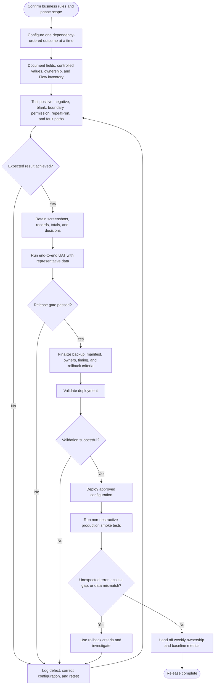

# Implementation, Testing, and Release

```mermaid
flowchart TD
    A([Confirm business rules and phase scope]) --> B[Configure one dependency-ordered outcome at a time]
    B --> C[Document fields, controlled values, ownership, and Flow inventory]
    C --> D[Test positive, negative, blank, boundary, permission, repeat-run, and fault paths]
    D --> E{Expected result achieved?}
    E -- No --> F[Log defect, correct configuration, and retest]
    F --> D
    E -- Yes --> G[Retain screenshots, records, totals, and decisions]
    G --> H[Run end-to-end UAT with representative data]
    H --> I{Release gate passed?}
    I -- No --> F
    I -- Yes --> J[Finalize backup, manifest, owners, timing, and rollback criteria]
    J --> K[Validate deployment]
    K --> L{Validation successful?}
    L -- No --> F
    L -- Yes --> M[Deploy approved configuration]
    M --> N[Run non-destructive production smoke tests]
    N --> O{Unexpected error, access gap, or data mismatch?}
    O -- Yes --> P[Use rollback criteria and investigate]
    P --> F
    O -- No --> Q[Hand off weekly ownership and baseline metrics]
    Q --> R([Release complete])
```

