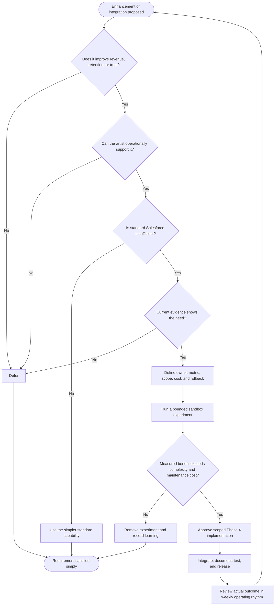

# Optimization Decision

```mermaid
flowchart TD
    A([Enhancement or integration proposed]) --> B{Does it improve revenue, retention, or trust?}
    B -- No --> Z[Defer]
    B -- Yes --> C{Can the artist operationally support it?}
    C -- No --> Z
    C -- Yes --> D{Is standard Salesforce insufficient?}
    D -- No --> E[Use the simpler standard capability]
    D -- Yes --> F{Current evidence shows the need?}
    F -- No --> Z
    F -- Yes --> G[Define owner, metric, scope, cost, and rollback]
    G --> H[Run a bounded sandbox experiment]
    H --> I{Measured benefit exceeds complexity and maintenance cost?}
    I -- No --> J[Remove experiment and record learning]
    I -- Yes --> K[Approve scoped Phase 4 implementation]
    K --> L[Integrate, document, test, and release]
    L --> M[Review actual outcome in weekly operating rhythm]
    M --> A
    E --> N([Requirement satisfied simply])
    J --> N
    Z --> N
```

