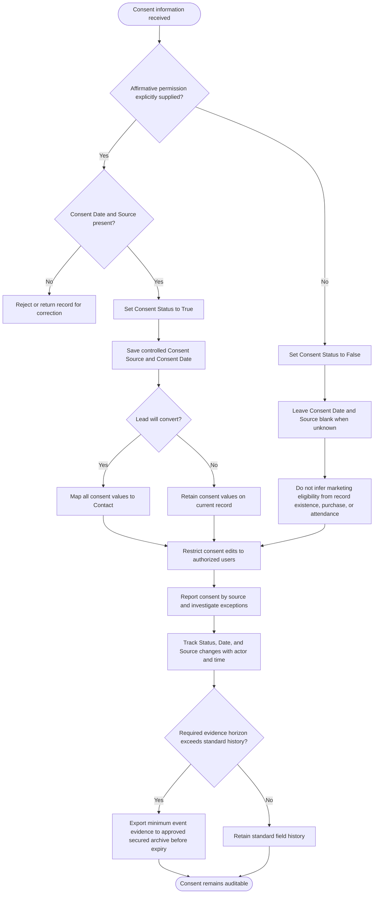

# Consent Management

```mermaid
flowchart TD
    A([Consent information received]) --> B{Affirmative permission explicitly supplied?}
    B -- No --> C[Set Consent Status to False]
    C --> D[Leave Consent Date and Source blank when unknown]
    D --> E[Do not infer marketing eligibility from record existence, purchase, or attendance]
    B -- Yes --> F{Consent Date and Source present?}
    F -- No --> G[Reject or return record for correction]
    F -- Yes --> H[Set Consent Status to True]
    H --> I[Save controlled Consent Source and Consent Date]
    I --> J{Lead will convert?}
    J -- Yes --> K[Map all consent values to Contact]
    J -- No --> L[Retain consent values on current record]
    K --> M[Restrict consent edits to authorized users]
    L --> M
    E --> M
    M --> N[Report consent by source and investigate exceptions]
    N --> O[Track Status, Date, and Source changes with actor and time]
    O --> P{Required evidence horizon exceeds standard history?}
    P -- Yes --> Q[Export minimum event evidence to approved secured archive before expiry]
    P -- No --> R[Retain standard field history]
    Q --> S([Consent remains auditable])
    R --> S
```
