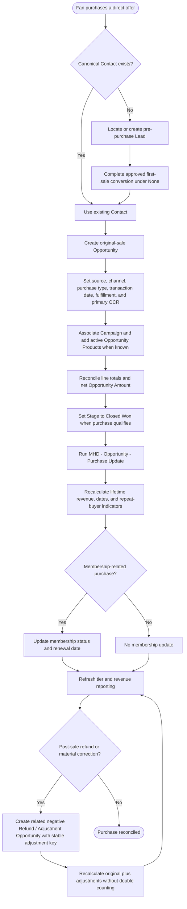

# Direct Offer Purchase

```mermaid
flowchart TD
    A([Fan purchases a direct offer]) --> B{Canonical Contact exists?}
    B -- Yes --> C[Use existing Contact]
    B -- No --> D[Locate or create pre-purchase Lead]
    D --> E[Complete approved first-sale conversion under None]
    E --> C
    C --> F[Create original-sale Opportunity]
    F --> G[Set source, channel, purchase type, transaction date, fulfillment, and primary OCR]
    G --> H[Associate Campaign and add active Opportunity Products when known]
    H --> I[Reconcile line totals and net Opportunity Amount]
    I --> J[Set Stage to Closed Won when purchase qualifies]
    J --> K[Run MHD - Opportunity - Purchase Update]
    K --> L[Recalculate lifetime revenue, dates, and repeat-buyer indicators]
    L --> M{Membership-related purchase?}
    M -- Yes --> N[Update membership status and renewal date]
    M -- No --> O[No membership update]
    N --> P[Refresh tier and revenue reporting]
    O --> P
    P --> Q{Post-sale refund or material correction?}
    Q -- Yes --> R[Create related negative Refund / Adjustment Opportunity with stable adjustment key]
    R --> T[Recalculate original plus adjustments without double counting]
    T --> P
    Q -- No --> S([Purchase reconciled])
```
