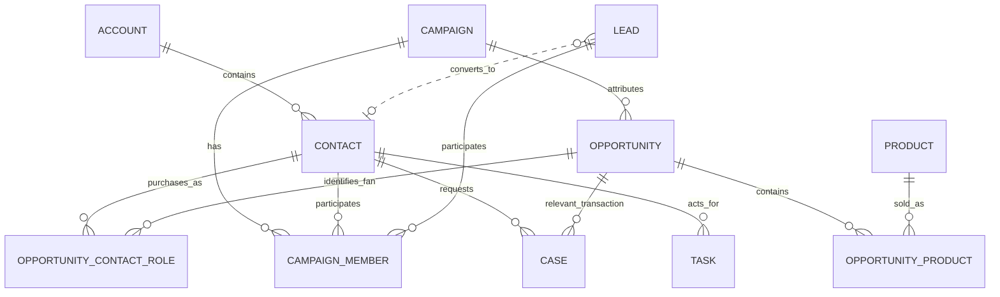
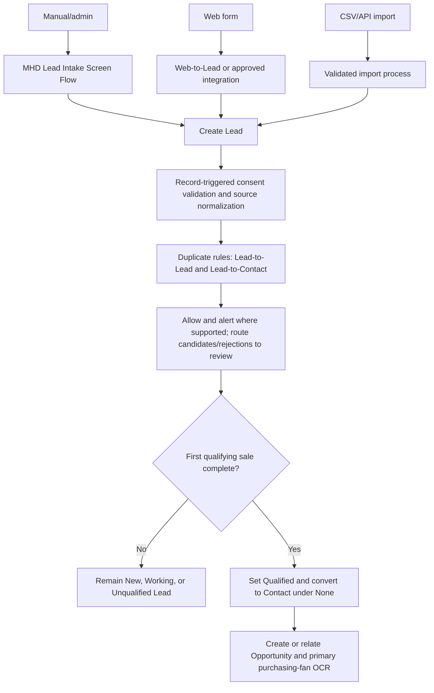

# Solution Design

This document bridges authoritative Strategy and Discovery decisions to the desktop wireframes. It defines the leanest maintainable Salesforce design; it does not replace controlled values, field mappings, process maps, or implementation gates.

## Authority and boundaries

- Strategy controls scope, architecture, approved decisions, and the nine automation outcomes.
- Discovery controls business flow, controlled values, mappings, consent, duplicate handling, and KPI definitions.
- This document resolves how those decisions appear in Salesforce. If it conflicts with Strategy or Discovery, the authoritative source wins and this design must be corrected.
- Prefer standard objects, standard reporting, narrow Flow, and human review. Add custom data only after a documented reporting or audit requirement cannot be met by the standard model.

## Core record model

- Contact is the canonical fan. Ordinary fan Contacts use the shared **None** Account; no Person Accounts or Account-per-fan pattern.
- A pre-purchase person remains a Lead. Convert only when the first qualifying sale is complete, select **None**, preserve mapped fields and consent, and relate the purchase.
- Every ordinary fan purchase has one primary Opportunity Contact Role identifying the purchasing Contact. `Opportunity.AccountId = None` does not identify the fan.
- Membership/VIP is a Contact panel backed by Contact fields, Products, Opportunities, Campaigns, and Tasks—not a related custom membership object.

## Intake channels and conversion

The Screen Flow is user initiated; Web-to-Lead and imports do not enter an interactive screen. Each channel uses the same approved field rules, consent evidence, normalized source values, duplicate coverage, and exception-handling outcome.

## Opportunity, products, and direct revenue

`Opportunity.Amount` is net take-home Direct Revenue:

`Amount = Gross Transaction Amount - Tax Amount - Platform / Payment Fees - Refunds / Chargebacks - MIN(Shipping Collected, Shipping Cost)`

Opportunity Products preserve the items, quantities, and selling prices. Their gross merchandise line total does not normally equal `Amount`. Validate each component and reconcile both views to the source transaction; do not use a line/Amount equality rule.

For Direct Revenue by Product, allocate `Amount` proportionally by each qualifying line's extended selling price. If gross qualifying line totals are zero, leave product allocation unattributed and route the transaction for review. Round allocations to currency precision and assign any rounding remainder to the largest qualifying line so allocations equal `Amount`. Refunds and corrections rerun the same calculation idempotently. This reporting allocation is derived; do not add product-allocation fields until the chosen Salesforce report/Flow implementation proves they are necessary.

Purchase acceptance requires:

- the shared **None** Account for an ordinary fan;
- one primary Opportunity Contact Role for the purchasing Contact;
- the six revenue-normalization inputs and reconciled `Amount`;
- active Standard Price Book lines when products are known;
- source, Close Date, Revenue Channel, Order Source, Stage, and external key where applicable.

## Duplicate-review persistence

Use Salesforce Duplicate Management first:

1. Separate Lead-to-Lead, Contact-to-Contact, and Lead-to-Contact duplicate rules create standard duplicate visibility.
2. Duplicate Record Sets and Duplicate Record Items are the candidate backlog and report source.
3. One Task on the reviewed Lead or Contact carries the operational state. Use a controlled subject such as `Duplicate Review`, standard Status (`Not Started`, `In Progress`, `Waiting on Someone Else`, `Deferred`, `Completed`), owner, due date, and a short Description containing pair type, decision, reason, and survivor link when applicable.
4. Keep-separate, merge, and Lead-to-Contact resolutions are manual. Completing the Task records reviewer and completion time through standard activity fields; the Duplicate Record Set remains the candidate evidence.

Do not create a custom review object unless testing proves standard Duplicate Record Sets plus Tasks cannot support backlog, ownership, resolution evidence, and reporting.

## Tier, lapse, and history

- `Fan_Tier__c` stores the current tier; `Lapsed_Fan_Flag__c` remains independent.
- No manual override controls are in MVP because Strategy/Discovery define no persistence fields or approval model. Correct source data or documented thresholds, then rerun evaluation.
- Enable Contact Field History Tracking for `Fan_Tier__c` (and `Lapsed_Fan_Flag__c` where useful). Tier history supplies transition date, old value, new value, and user/process identity without a custom object.
- **True Fan emergence** is measured from spend evidence: count distinct Contacts whose qualifying cumulative direct spend causes a tracked transition into True Fan or Patron during the period. The tier threshold must be documented before activation.
- **Fan growth** is the change in canonical fan count: ending Contact count minus beginning Contact count. Use report snapshots when a historical beginning balance is not otherwise reproducible.

If standard field history retention or reporting cannot meet an implementation's required analysis window, document that gap before adding a reporting snapshot or custom history store.

## Cases and due-date handling

Use standard Case fields and governed values: `Type`, `Reason`, `Origin`, `Priority`, Contact, Status (`New`, `Working`, `Escalated`, `Closed`), plus `Relevant_Transaction__c`, `Next_Action__c`, and `Next_Action_Due_Date__c`.

Product context is derived through the relevant Opportunity and its Products. Campaign context is derived through the relevant Opportunity when present; add no Case lookup merely to decorate the page. Membership context comes from the Contact panel and related purchase. Unresolved work uses owner, age, next action, and due date. Do not call this an SLA unless Entitlements/Milestones are deliberately implemented.

## Reportable exception handling

Use Tasks as the lean standard exception record for Flow, intake, and import failures that need human action:

- controlled subjects: `Exception - Flow`, `Exception - Intake`, or `Exception - Import`;
- Owner, Status, Priority, ActivityDate, and related Lead/Contact/Opportunity/Case where available;
- Description: automation/import name, run or batch reference, failed record/source key, concise error, retry guidance, and occurrence time;
- idempotency key in the description or source reference so a retry does not create duplicate open Tasks.

Interactive Flow faults display a useful message and create the exception Task through a fault-path subflow or equivalent standard mechanism. Import operators create one batch-level Task plus attach/link the rejected-row file in the secured implementation workspace; create record-level Tasks only where individual resolution is required. Dashboards count open exception Tasks by controlled subject. Salesforce automated-process error emails/logs remain diagnostic evidence, not the reportable work queue.

## Automation interaction boundaries

The nine approved outcomes remain separate: New Fan Intake, Lead Conversion Follow-Through, Consent Validation, Purchase Update, Fan Tier Evaluation, Lapsed Fan Evaluation, Campaign Member Follow-Up, Membership Renewal, and Case Triage. Each automation has one owner, documented entry criteria, idempotent behavior, test evidence, and a reportable fault path. Shared subflows are limited to stable cross-cutting behavior such as exception Task creation.

## Reporting dependencies

- Current fan value comes from qualifying Opportunities rolled up to Contact.
- Historical tier movement comes from Contact field history; period fan counts use report snapshots when necessary.
- Duplicate backlog comes from unresolved Duplicate Record Sets and their review Tasks.
- Flow/intake/import exception counts come from open controlled-subject Tasks.
- Case aging and due work come from standard dates plus `Next_Action_Due_Date__c`.
- Every dashboard measure must drill to its governed source report and source records.

## Implementation checks

- Test manual, Web-to-Lead, import/API, conversion, duplicate, and fault paths independently.
- Prove the primary purchasing-fan Opportunity Contact Role exists and revenue does not double count.
- Reconcile gross components, product lines, net `Amount`, product allocation, refunds, and corrections.
- Verify tier transitions appear in field history and spend-triggered emergence reports.
- Confirm keep-separate and resolved duplicate reviews retain evidence without a custom object.
- Confirm each exception card drills to owned Tasks with due dates and retry guidance.
