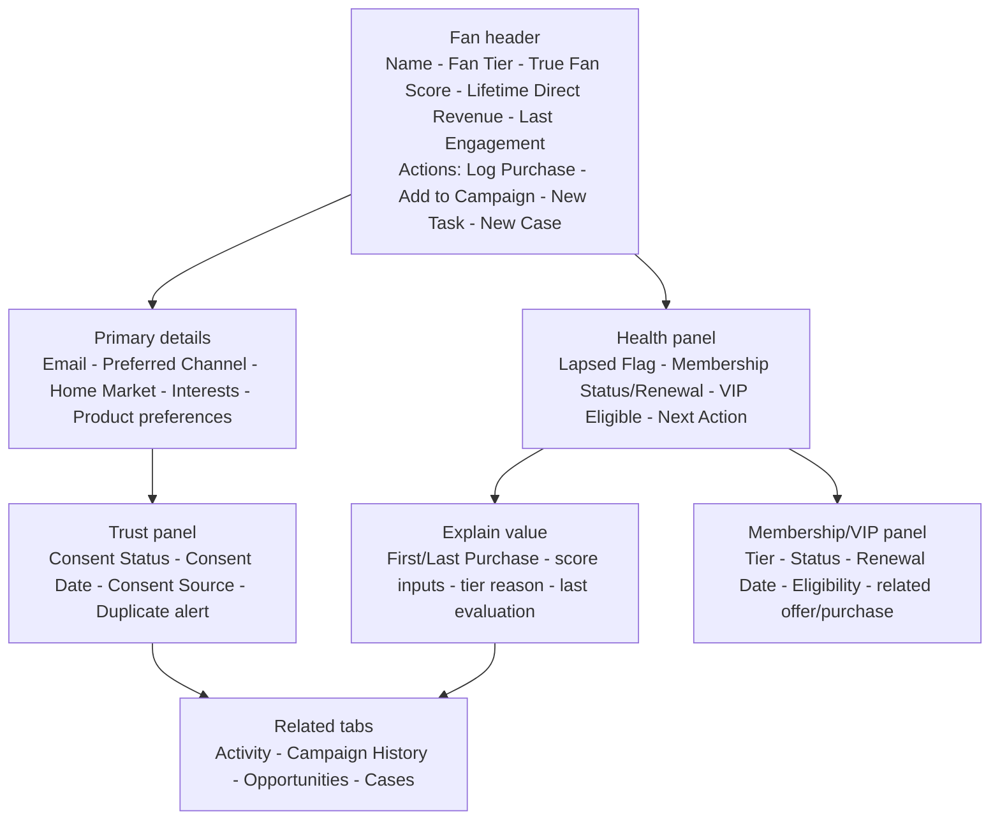

# Fan Record Page

## Purpose

Provide one trustworthy supporter profile for relationship, revenue, membership/VIP, touring, and service decisions.

## Desktop wireframe

## Rules

- This is a Contact page. Ordinary fan Contacts use the shared **None** Account; business or organizational relationships may use another Account.
- Consent is explicit and separate from record existence, purchases, attendance, or engagement.
- System-maintained revenue, tier, score, and lapsed fields are read-only. Correct source data or documented thresholds, then rerun evaluation.
- `Possible Duplicate` is visible but does not block work; it opens the Duplicate Review Queue.
- Membership/VIP fields are part of the Phase 2 MVP and are shown when that business motion is configured.
- Membership/VIP is a panel backed by Contact fields and standard related records, not a custom related object.
- Fan Tier field history preserves tier transitions for emergence reporting.
- `Next Action` is the nearest open Task's governed subject/due work, not a Contact field. `Tier reason` is an explanatory display derived from approved evaluation inputs and thresholds. `Last evaluation` is the most recent Flow run/change evidence available to the page; none of these labels authorizes new persistence fields.

## States

- **Listener:** known supporter with no qualifying direct purchase.
- **Buyer / Repeat Buyer / True Fan / Patron:** increasingly valuable or recurring relationship.
- **Lapsed Flag:** separate from Fan Tier; identifies a previously valuable supporter beyond the approved inactivity threshold.
- **Restricted:** user can view only permitted PII and cannot edit consent or merge records.

## Acceptance checks

- Identity, trust, value, recency, membership/VIP, service, and next action are understandable without searching.
- Campaigns, purchases, Cases, and Tasks remain connected to the survivor after a merge.
- Missing data is shown as unknown, never inferred.
