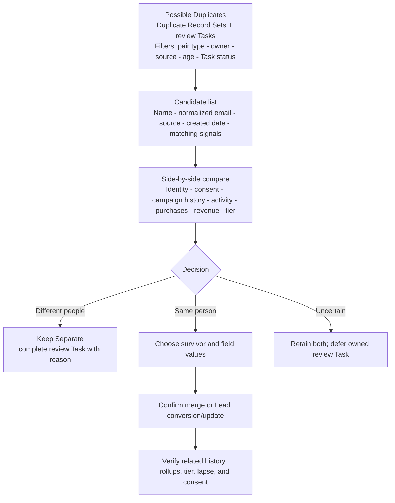

# Duplicate Review Queue

## Purpose

Resolve suspected Lead-to-Lead, Contact-to-Contact, and Lead-to-Contact matches without blocking legitimate intake or destroying fan history.

## Desktop wireframe

## Rules

- Flag, alert, and report; do not automatically block or merge.
- Normalized email is primary; name supports matching but never proves identity alone.
- A user continuing intake after a warning acknowledges that the potential duplicate was reviewed.
- The survivor should have the strongest history and data quality.
- A merge must never upgrade consent silently.
- Only authorized users can merge; unresolved ambiguity preserves both records.
- Duplicate Record Sets and Items persist candidates. A standard Task with controlled subject `Duplicate Review` persists owner, due date, status, decision/reason, reviewer, and completion time.
- Do not add a custom duplicate-review object unless representative testing proves the standard records cannot meet audit and backlog needs.

## Acceptance checks

- Exact email, case variation, same name/different email, blank email, and shared email are distinguishable.
- Create, edit, import, and Lead-conversion paths surface expected candidates.
- Campaigns, Tasks, Cases, Opportunities, revenue, dates, tier, and lapse status remain correct after resolution.
