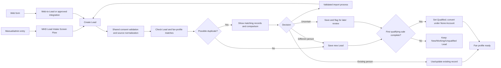
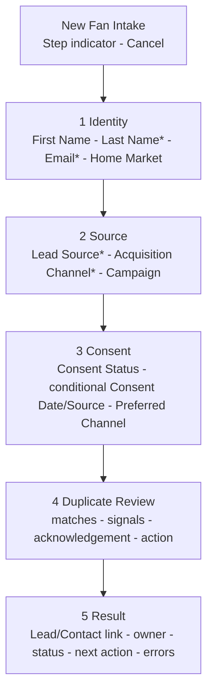

# New Fan Intake

## Purpose

Capture or import a fan with controlled identity, source, consent, ownership, and duplicate review before the record becomes a trusted fan profile.

## Process

## Desktop Screen Flow

## Rules

- Company is auto-populated with the MHD placeholder; do not ask the fan.
- Lead lifecycle: `New`, `Working`, `Qualified`, `Unqualified`.
- If Consent Status is true, Consent Date and Consent Source are required; otherwise they may be blank.
- Existing email, purchase, attendance, or import never implies affirmative consent.
- Duplicate warnings allow explicit continuation; no silent creation, automatic block, or merge.
- The Screen Flow is user initiated. Web and import paths use the same governed fields and duplicate coverage without entering an interactive screen.
- Shared fault handling shows an actionable message, creates an owned exception Task where action is required, and never claims success after failure.
- Convert only after the first qualifying sale; create or relate the qualifying Opportunity and its primary purchasing-fan Opportunity Contact Role.

## Acceptance checks

- Clean, duplicate, Lead-to-Contact, conversion, consent, import, and fault scenarios match the runbook UAT cases.
- Source, acquisition channel, consent, owner, and campaign context survive conversion.
