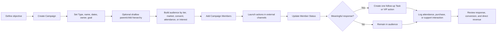
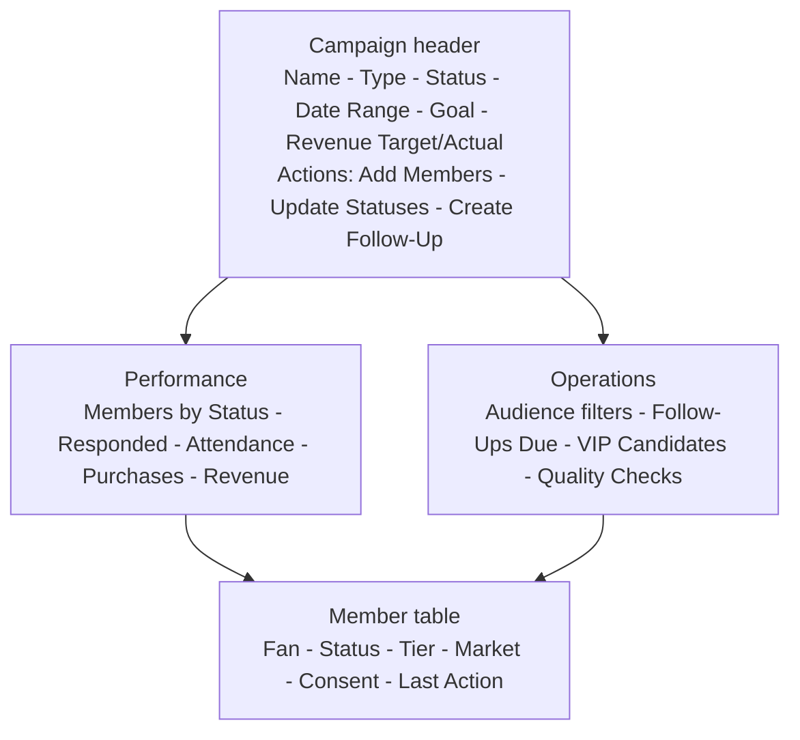

# Campaign Workspace

## Purpose

Plan and operate releases, tours, shows, merch drops, crowdfunding, fan-club initiatives, and VIP offers with standard Campaigns and Campaign Members.

## Process

## Desktop wireframe

## Rules

- Naming: `YYYY - Type - Name`; show example: `2026 - Show - Denver - Venue Name`.
- Tour uses a parent Campaign with individual Show children; other hierarchies stay shallow.
- Member statuses are small, ordered, comparable, and mark at least one value as `Responded` when needed.
- External tools deliver messages; Salesforce owns the audience, response, follow-up, and outcome record.
- Marketing audience filters exclude non-consented fans where required.

## Acceptance checks

- Comparable campaigns share Types and status meanings.
- Show attendance and post-show conversion can be filtered by Home Market.
- Revenue and response measures expose attribution assumptions.
