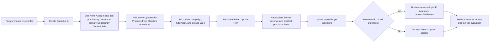
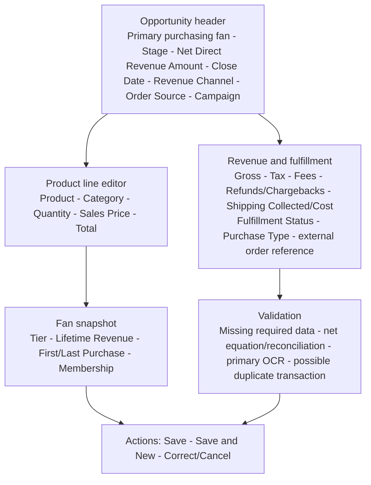

# Opportunity Entry

## Purpose

Record a direct offer purchase with standard Opportunity, Product, Price Book, and Opportunity Product data, then refresh the fan profile without double counting.

## Process

## Desktop wireframe

## Rules

- Stages stay minimal: `Open`, `Closed Won`, `Closed Lost`.
- Salesforce stores reporting and fulfillment context, never payment-card data.
- Rollups recalculate from qualifying transactions so edits, cancellations, and Flow retries are idempotent.
- Membership and VIP products use the same product/revenue model; no custom transaction object is introduced.
- Opportunity Product totals preserve gross item detail; they are not required to equal net `Opportunity.Amount`.
- Direct Revenue by Product allocates net Amount proportionally across qualifying product lines, with zero-line exceptions left unattributed for review.
- Every ordinary fan purchase uses the **None** Account and one primary Opportunity Contact Role identifying the purchasing Contact.

## Acceptance checks

- First, repeat, multiline, membership/VIP, corrected, canceled, and retry cases reconcile.
- Opportunity Amount agrees with the governed net-revenue equation; product-line allocation reconciles back to Amount.
- The purchasing fan is traceable through one primary Opportunity Contact Role.
- Contact revenue and purchase dates can be traced to source Opportunities.
