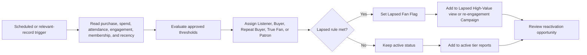
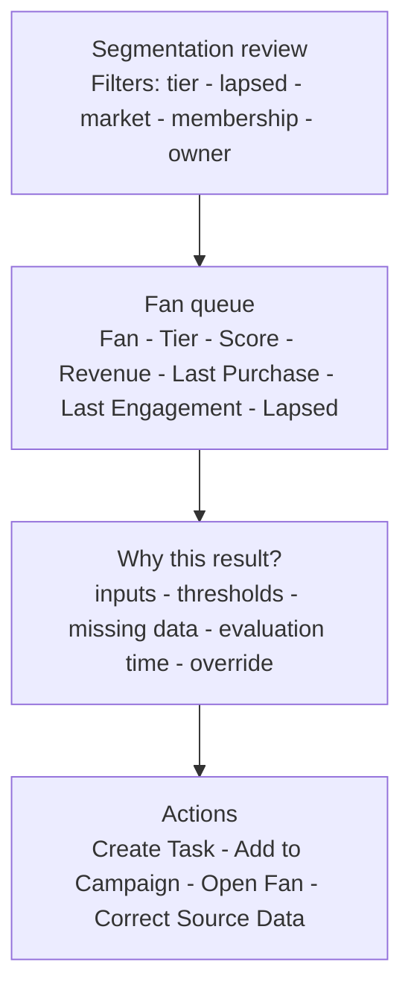

# Fan Tier and Reactivation

## Purpose

Explain the scheduled fan-tier/lapsed evaluation and turn high-value inactivity into selective human follow-up.

## Process

## Desktop wireframe

## Rules

- Fan Tier summarizes the relationship; True Fan Score remains a supporting, explainable indicator rather than predictive AI.
- Thresholds use only reliably maintained data and cover blanks, boundaries, and never-purchased/never-engaged fans.
- Repeated runs are safe and do not duplicate Tasks or Campaign Members.
- Manual tier overrides are not in MVP because no approved persistence or authorization model exists. Correct governed source data or thresholds and rerun evaluation.
- Contact Field History Tracking preserves `Fan_Tier__c` transitions; emergence into True Fan or Patron is tied to the qualifying cumulative-spend change.
- Reactivation remains selective and personal, not bulk spam.

## Acceptance checks

- Test fans at every boundary produce expected tier and lapse outcomes.
- First/repeat purchase and membership status changes refresh the appropriate evaluation.
- The lapsed queue supports a small, owned next action.
- Tier-change history identifies who crossed the spend threshold during the reporting period.
