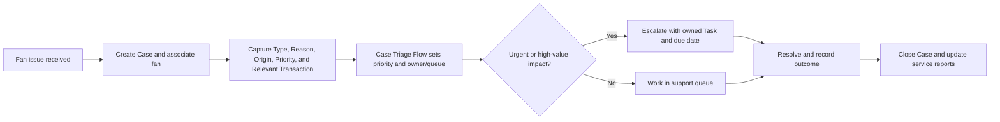
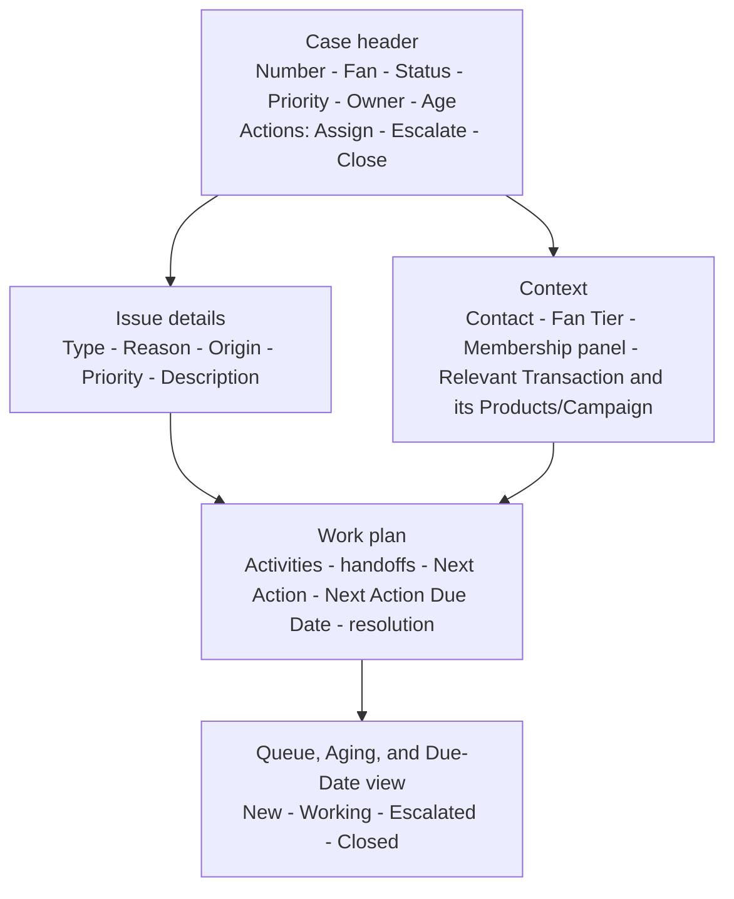

# Case Triage

## Purpose

Track order, digital-access, event, membership, and general fan-support issues with standard Cases and a narrow triage Flow.

## Process

## Desktop wireframe

## Rules

- Use the standard Case object and controlled Type values for Order, Digital Access, Event, Membership, Billing, and General Support.
- Triage assigns a queue/owner and priority; human judgment handles sensitive/high-value interactions.
- Do not expose unnecessary PII or payment-card data.
- A Case links to Contact and `Relevant_Transaction__c`; Product and Campaign context derives through the transaction, while membership context comes from the Contact panel.
- Status is `New`, `Working`, `Escalated`, or `Closed`. Open work uses age, Next Action, and Next Action Due Date; no SLA/entitlement is implied.
- Faults create controlled-subject exception Tasks with an owner, due date, source reference, and retry guidance.

## Acceptance checks

- New, reassigned, escalated, closed, and reopened paths are visible.
- Open Case age and resolution time reconcile to the Operations Dashboard.
- Membership, VIP, order, and event issues retain their related business context.
