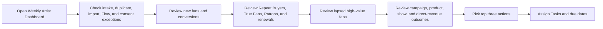
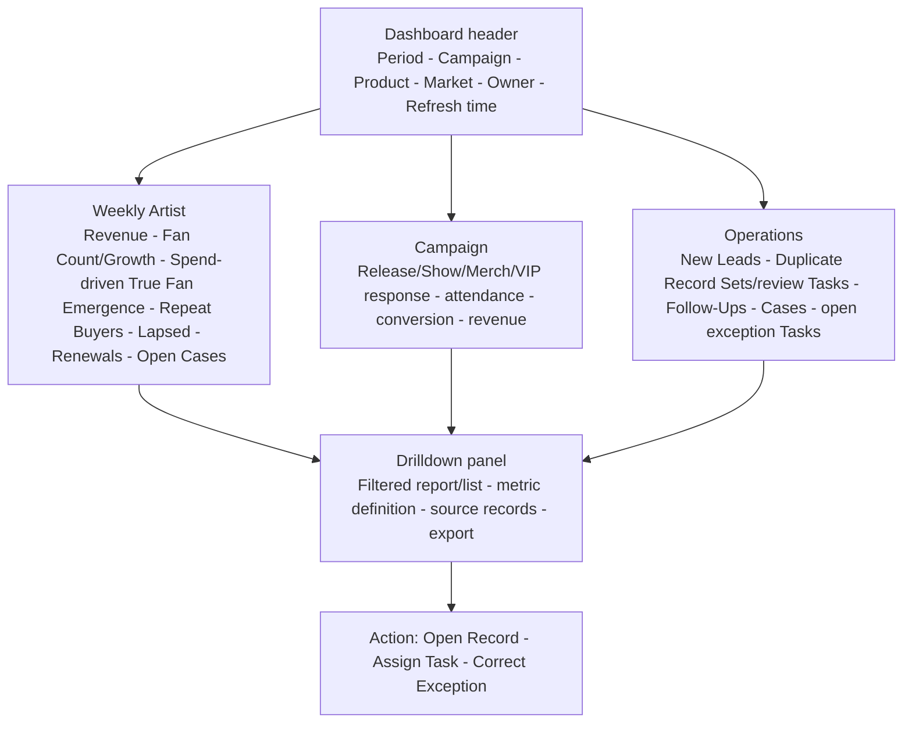

# Reports and Dashboard Drilldown

## Purpose

Turn the weekly artist review into a short, traceable decision workflow across business results and operating health.

## Weekly review process

## Desktop wireframe

## Governed reports

- Fans by Tier; Fan Count/Growth; Spend-Driven True Fan Emergence from tier history; Lapsed High-Value Fans; Repeat Buyers.
- Direct Revenue by Campaign and Product.
- Membership Renewals/Churn.
- Show Attendance by Market and Post-Show Conversion.
- Case Volume/Resolution Time; Consent by Source; Duplicate Review.

## Rules and acceptance checks

- Every metric has a definition, date rule, filter, running user, and source report.
- Unattributed revenue, refunds/cancellations, and test records are explicit.
- Every dashboard total reconciles to source reports and sample records.
- Drill-down always ends in a record or owned action.
- Historical fan counts use report snapshots when needed; tier transitions use Contact field history.
- Import, intake, and Flow exceptions drill to controlled-subject Tasks rather than unpersisted error messages.
