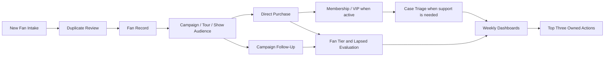

# MHD Salesforce Wireframes

Desktop-first, low-fidelity wireframes for every functional area in the broad Mile High Dreamin Salesforce strategy. They use the repository's existing terminology and favor standard Salesforce objects, focused Lightning pages, list views, reports, dashboards, and narrow Flows.

## Index

1. [Fan Record Page](01-fan-record-page) - canonical supporter profile and related history.
2. [Duplicate Review Queue](02-duplicate-review-queue) - flag-not-block comparison and manual resolution.
3. [New Fan Intake](03-new-fan-intake) - capture, consent, source, duplicate check, and conversion.
4. [Campaign Workspace](04-campaign-workspace) - release, tour, show, merch, crowdfunding, fan-club, and VIP audience operations.
5. [Opportunity Entry](05-opportunity-entry) - products, purchases, fulfillment, rollups, and supporter-program updates.
6. [Fan Tier and Reactivation](06-fan-tier-and-reactivation) - tier/score/lapse evaluation and selective follow-up.
7. [Membership and VIP](07-membership-and-vip) - Phase 3 renewals, eligibility, offers, and fulfillment.
8. [Case Triage](08-case-triage) - fan service assignment, escalation, resolution, and reporting.
9. [Reports and Dashboard Drilldown](09-reports-and-dashboard-drilldown) - weekly, campaign, and operations insight.
10. [Home](10-home) - weekly system-health and action workspace.

## Business-process coverage

| Strategy outcome | Primary wireframes | Existing process-map source |
|---|---|---|
| Fan Identity & Trust | New Fan Intake; Duplicate Review Queue; Fan Record Page | [Fan Intake Lead Management](../../02-discovery/01-business-process-maps/01-fan-intake-lead-management.md) |
| Fan Tiering | Fan Record Page; Fan Tier and Reactivation | [Fan Tier Assessment Pipeline](../../02-discovery/01-business-process-maps/06-fan-tier-lapsed-evaluation.md) |
| Campaigns & Revenue | Campaign Workspace; Opportunity Entry | [Campaign Audience](../../02-discovery/01-business-process-maps/04-campaign-audience-follow-up.md); [Direct Offer Purchase](../../02-discovery/01-business-process-maps/05-direct-offer-purchase.md) |
| Membership/VIP | Membership and VIP; Opportunity Entry; Campaign Workspace | Strategy and implementation plan |
| Touring & Activation | Campaign Workspace; Fan Record Page; Reports and Dashboard Drilldown | Campaign Audience |
| Service & Retention | Case Triage; Fan Tier and Reactivation | Strategy and implementation plan |
| Governance & Insight | Home; Reports and Dashboard Drilldown | [Artist Revenue Review](../../02-discovery/01-business-process-maps/10-weekly-artist-review.md) |

## Shared design rules

- Use the fan-profile model selected at the Contact-versus-Person-Account prebuild gate.
- Consent is affirmative, auditable, and never inferred from a purchase, attendance, interaction, email address, or import.
- Suspected duplicates alert, save, report, and route to human review; do not automatically merge or block.
- Standard objects first: Lead, Contact/Person Account, Campaign, Campaign Member, Opportunity, Opportunity Product, Product, Price Book, Case, and Task.
- One Flow per business outcome where practical; every Flow has an owner, description, test evidence, and fault path.
- External platforms may remain systems of record; Salesforce owns the relationship view and only the data needed for decisions.
- Every dashboard or score must drill down to understandable source records and a human action.

## End-to-end view

