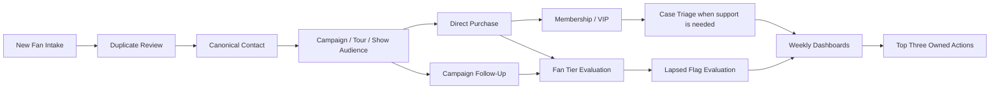

# MHD Salesforce Wireframes

Desktop-first, low-fidelity wireframes for every functional area in the Mile High Dreamin Salesforce strategy. They use standard Salesforce objects, focused Lightning pages, list views, reports, dashboards, and narrow Flows.

[Design index](../README.md) · [Strategy](../../01-strategy/README.md) · [Discovery](../../02-discovery/README.md)

## Index

1. [Fan Record Page](01-fan-record-page) — canonical Contact profile and related history.
2. [Duplicate Review Queue](02-duplicate-review-queue) — flag-not-block comparison and manual resolution.
3. [New Fan Intake](03-new-fan-intake) — capture, consent, source, duplicate check, and first-sale conversion.
4. [Campaign Workspace](04-campaign-workspace) — release, tour, show, merch, crowdfunding, fan-club, and VIP audiences.
5. [Opportunity Entry](05-opportunity-entry) — products, purchases, fulfillment, rollups, and supporter-program updates.
6. [Fan Tier and Reactivation](06-fan-tier-and-reactivation) — tier/score evaluation, separate Lapsed Flag, and selective follow-up.
7. [Membership and VIP](07-membership-and-vip) — Phase 2 MVP renewals, eligibility, offers, and fulfillment.
8. [Case Triage](08-case-triage) — fan service assignment, escalation, resolution, and reporting.
9. [Reports and Dashboard Drilldown](09-reports-and-dashboard-drilldown) — weekly, Campaign, and operations insight.
10. [Home](10-home) — weekly system health and action workspace.

## Business-process coverage

| Strategy outcome | Primary wireframes | Process-map source |
|---|---|---|
| Fan Identity & Trust | New Fan Intake; Duplicate Review Queue; Fan Record Page | [Fan Intake and Lead Management](../../02-discovery/03-business-process-maps/01-fan-intake-lead-management.md) |
| Fan Tiering & Lapse | Fan Record Page; Fan Tier and Reactivation | [Fan Tier and Lapsed Evaluation](../../02-discovery/03-business-process-maps/06-fan-tier-lapsed-evaluation.md) |
| Campaigns & Revenue | Campaign Workspace; Opportunity Entry | [Campaign Audience](../../02-discovery/03-business-process-maps/04-campaign-audience-follow-up.md); [Direct Offer Purchase](../../02-discovery/03-business-process-maps/05-direct-offer-purchase.md) |
| Membership/VIP | Membership and VIP; Opportunity Entry; Campaign Workspace | [Membership Renewal and VIP](../../02-discovery/03-business-process-maps/08-membership-renewal-vip.md) |
| Touring & Activation | Campaign Workspace; Fan Record Page; Reports and Dashboard Drilldown | [Campaign Audience](../../02-discovery/03-business-process-maps/04-campaign-audience-follow-up.md) |
| Service & Retention | Case Triage; Fan Tier and Reactivation | [Case Triage](../../02-discovery/03-business-process-maps/09-case-triage-fan-service.md); [Lapsed Re-Engagement](../../02-discovery/03-business-process-maps/07-lapsed-fan-reengagement.md) |
| Governance & Insight | Home; Reports and Dashboard Drilldown | [Weekly Artist Review](../../02-discovery/03-business-process-maps/10-weekly-artist-review.md) |

## Shared design rules

- Use the standard Account + Contact model. Contacts are canonical fans; ordinary fans use the shared **None** Account.
- Consent is affirmative, auditable, and never inferred from a purchase, attendance, interaction, email address, or import.
- Suspected duplicates alert, save, report, and route to human review; do not automatically merge or block.
- Standard objects first: Account, Lead, Contact, Campaign, Campaign Member, Opportunity, Opportunity Contact Role, Opportunity Product, Product, Price Book, Case, and Task.
- Lapsed is a separate flag, not a Fan Tier value.
- Keep one automation outcome per Flow where practical; each has a description, test evidence, and fault path.
- External platforms may remain systems of record; Salesforce owns the relationship view and only the data needed for decisions.
- Every dashboard or score must drill down to understandable source records and a human action.

## End-to-end view

